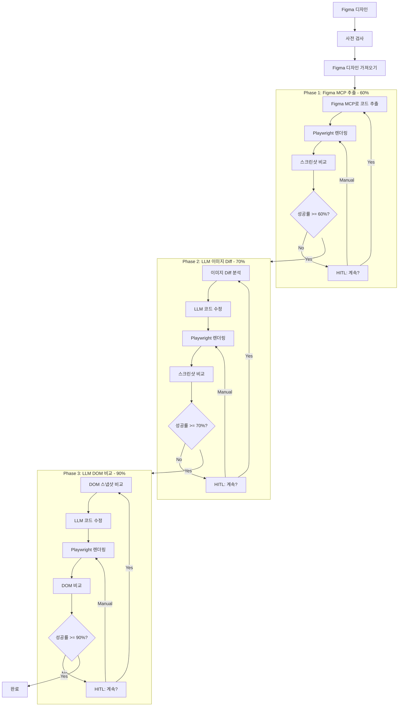
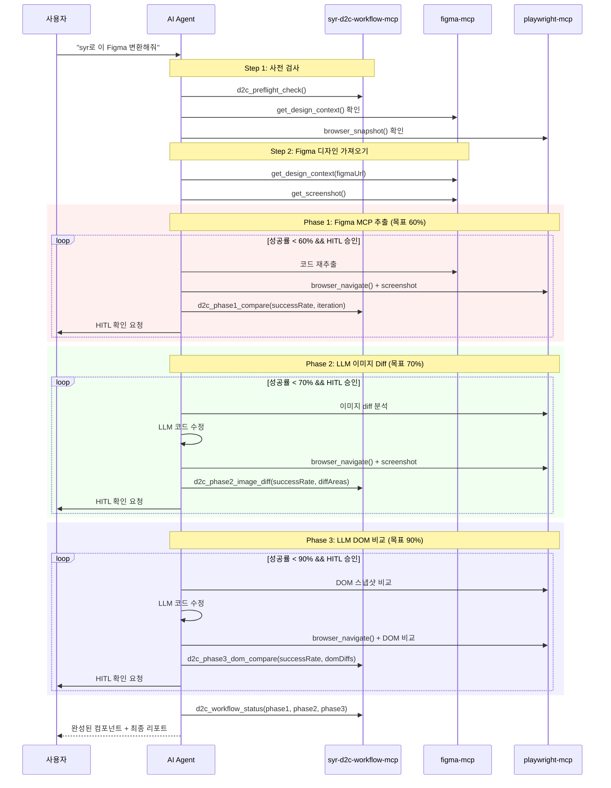
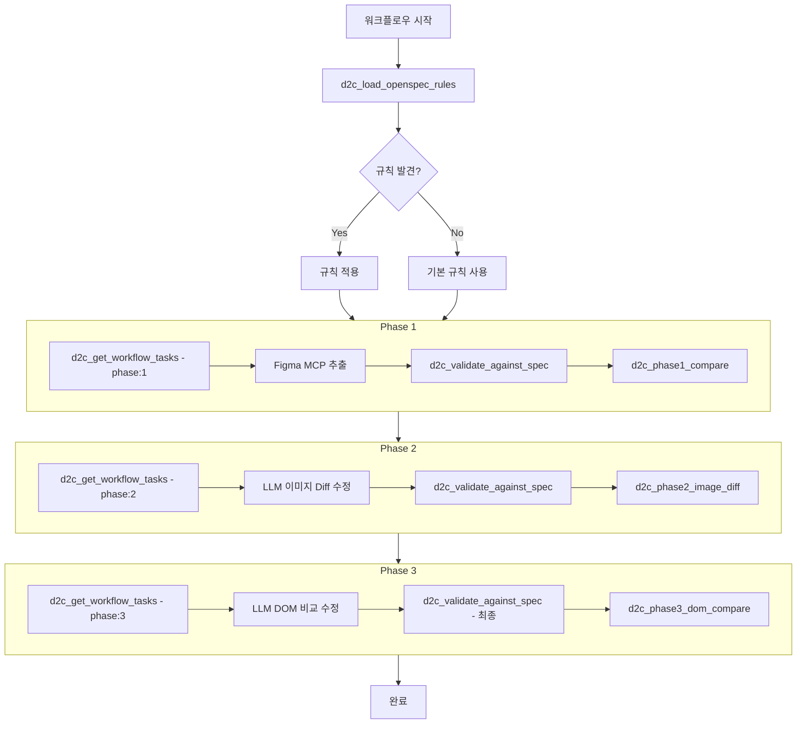

# SYR D2C Workflow MCP

Figma 디자인을 프로덕션 레디 컴포넌트로 변환하는 워크플로우 MCP 서버입니다.

## 기능

- 🎯 **의존성 사전 검사**: figma-mcp, playwright-mcp 설치 여부 확인 및 가이드
- 📋 **규칙 관리**: 여러 규칙 파일을 통합하여 로드
- 🔍 **컴포넌트 검증**: 생성된 코드가 규칙에 맞는지 검증
- 📊 **디자인 비교**: 원본 디자인과 렌더링 결과 비교
- 🎨 **템플릿 생성**: React/Vue/Svelte 보일러플레이트 생성
- 📚 **워크플로우 가이드**: 전체 D2C 프로세스를 안내하는 프롬프트

## 설치

### 사용처에서 설치

```json
// .vscode/mcp.json
{
  "servers": {
    "d2c": {
      "command": "npx",
      "args": ["syr-d2c-workflow-mcp"],
      "env": {
        "RULES_PATHS": "./docs/standards.md,./rules/components.md",
        "RULES_GLOB": "**/*-rules.md"
      }
    }
  }
}
```

### 함께 필요한 MCP들

```json
{
  "servers": {
    "d2c": {
      "command": "npx",
      "args": ["syr-d2c-workflow-mcp"]
    },
    "figma": {
      "command": "npx",
      "args": ["-y", "figma-developer-mcp", "--stdio"]
    },
    "playwright": {
      "command": "npx",
      "args": ["@anthropic/mcp-playwright"]
    }
  }
}
```

## 환경 변수

| 변수 | 설명 | 예시 |
|------|------|------|
| `RULES_PATHS` | 쉼표로 구분된 규칙 파일 경로들 | `./docs/a.md,./rules/b.md` |
| `RULES_GLOB` | 규칙 파일 glob 패턴 | `**/*-standards.md` |
| `D2C_CONFIG_PATH` | 설정 파일 경로 | `./d2c.config.json` |

### 설정 파일 예시

```json
// d2c.config.json
{
  "rules": [
    "./docs/design-standards.md",
    "./rules/component-rules.md",
    ".cursor/rules/*.md"
  ]
}
```

## 트리거 키워드

AI가 다음 키워드를 감지하면 이 MCP를 사용합니다:

- `syr`, `syr-d2c`, `d2cmcp`, `d2c mcp`
- "디자인 투 코드", "design to code", "figma 변환"
- "컴포넌트로 만들어줘", "코드로 변환해줘"

### 사용 예시

```
"syr로 이 Figma 변환해줘"
"d2c mcp로 컴포넌트 만들어줘"
"이 디자인을 코드로 변환해줘"
```

## 제공 도구 (Tools)

### `d2c_preflight_check`
워크플로우 실행 전 필수 의존성을 확인합니다.

### `d2c_get_design_rules`
설정된 경로들에서 디자인 규칙을 수집합니다.

```typescript
{
  customRules?: string;     // 추가 규칙
  includeDefaults?: boolean; // 기본 규칙 포함 (기본: true)
}
```

### `d2c_validate_component`
생성된 컴포넌트가 규칙에 맞는지 검증합니다.

```typescript
{
  code: string;           // 검증할 코드
  componentName: string;  // 컴포넌트 이름
  rules?: string;         // 적용할 규칙
}
```

### `d2c_log_step`
워크플로우 진행 상황을 실시간으로 출력합니다.

```typescript
{
  step: number;        // 현재 단계 번호 (1-6)
  stepName: string;    // 단계 이름
  status: "start" | "done" | "error";
  message?: string;    // 추가 메시지
  iteration?: number;  // 반복 횟수
}
```

### `d2c_get_component_template`
규칙에 맞는 컴포넌트 템플릿을 생성합니다.

```typescript
{
  componentName: string;                    // 컴포넌트 이름
  framework?: "react" | "vue" | "svelte";   // 프레임워크
  props?: PropDefinition[];                 // Props 정의
  hasChildren?: boolean;                    // children 포함 여부
}
```

## 제공 프롬프트 (Prompts)

### `design_to_code`
전체 D2C 워크플로우를 단계별로 안내합니다:

1. 사전 검사 (의존성 확인)
2. 규칙 수집
3. Figma 디자인 가져오기
4. 컴포넌트 생성
5. 검증
6. 렌더링 확인 (반복)
7. 완료

## 제공 리소스 (Resources)

- `d2c://rules/default` - 기본 디자인 규칙
- `d2c://templates/react` - React 컴포넌트 템플릿

## 3단계 Phase 워크플로우

v0.3.0부터 객관적인 성공률 측정을 위한 3단계 Phase 시스템을 지원합니다.

| Phase | 목표 성공률 | 비교 방법 | 수정 주체 |
|-------|-----------|----------|----------|
| **Phase 1** | 60% | Playwright 스크린샷 비교 | Figma MCP (재추출) |
| **Phase 2** | 70% | Playwright 이미지 diff | LLM (코드 수정) |
| **Phase 3** | 90% | Playwright DOM 비교 | LLM (코드 수정) |

### 워크플로우 개요



### 시퀀스 다이어그램



### HITL (Human-in-the-Loop)

모든 Phase에서 사용자 개입이 가능합니다:

- **[Y]** 계속 - 자동 수정 후 반복
- **[N]** 완료 - 현재 상태로 다음 단계 진행
- **[M]** 수동 수정 - 사용자가 직접 코드 수정 후 재비교
- **[S]** 중단 - 워크플로우 종료

## OpenSpec 규칙 통합

v0.4.0부터 사용자 프로젝트의 OpenSpec 규칙을 자동으로 탐지하고 워크플로우에 적용합니다.

### OpenSpec 규칙 구조

```
your-project/
├── openspec/
│   └── specs/
│       ├── figma-standard/     ← Figma 변환 규칙
│       │   └── spec.md
│       ├── design-rules/       ← 디자인 규칙
│       │   └── spec.md
│       └── custom-rules/       ← 커스텀 규칙
│           └── spec.md
└── src/
```

### 탐지 경로

다음 경로에서 OpenSpec 규칙을 자동으로 탐지합니다:

1. `./openspec/specs/*/spec.md`
2. `./.cursor/openspec/specs/*/spec.md`
3. `./docs/openspec/specs/*/spec.md`

### OpenSpec 도구

#### `d2c_load_openspec_rules`
프로젝트의 OpenSpec 규칙을 탐지하고 로드합니다.

```typescript
{
  forceReload?: boolean;     // 캐시 무시하고 다시 로드
  specNames?: string[];      // 특정 spec만 필터링
}
```

**반환값 예시:**
```
📋 OpenSpec 규칙 로드 결과

## 발견된 규칙 (2개)

### figma-standard
- 경로: `openspec/specs/figma-standard/spec.md`
- Requirements (3개):
    - 컴포넌트 네이밍 규칙 (2개 시나리오)
    - Props 인터페이스 정의 (1개 시나리오)
    - 접근성 속성 (2개 시나리오)

### design-rules
- 경로: `openspec/specs/design-rules/spec.md`
- Requirements (2개):
    - 색상 시스템 (1개 시나리오)
    - 타이포그래피 (1개 시나리오)
```

#### `d2c_get_workflow_tasks`
현재 Phase에 맞는 체크리스트를 반환합니다.

```typescript
{
  phase: 1 | 2 | 3;           // 현재 Phase
  completedTasks?: string[];  // 완료된 task ID 목록
  includeRules?: boolean;     // 적용 규칙 목록 포함
}
```

**반환값 예시:**
```markdown
## Phase 1: Figma MCP 추출 (목표 60%)

### 진행률: 33% (2/6)
███░░░░░░░

### Tasks
- [x] 1.1 Figma 디자인 컨텍스트 가져오기
- [x] 1.2 Figma MCP로 코드 추출
- [ ] 1.3 Playwright 렌더링
- [ ] 1.4 스크린샷 비교 (toHaveScreenshot)
- [ ] 1.5 d2c_phase1_compare 호출
- [ ] 1.6 HITL 확인

### 적용 규칙
- **figma-standard**: 컴포넌트 네이밍 규칙, Props 인터페이스 정의, 접근성 속성
- **design-rules**: 색상 시스템, 타이포그래피
```

#### `d2c_validate_against_spec`
생성된 코드가 OpenSpec 규칙을 준수하는지 검증합니다.

```typescript
{
  code: string;           // 검증할 코드
  specName?: string;      // 특정 spec만 검증
  componentName?: string; // 컴포넌트 이름
}
```

**반환값 예시:**
```
📋 OpenSpec 규칙 검증 결과

## 요약
- 통과: 3개 ✅
- 실패: 1개 ❌
- 경고: 1개 ⚠️
- 준수율: 60%

██████░░░░ 60%

## 상세 결과

✅ **컴포넌트 네이밍 규칙** (default)
   ButtonPrimary은(는) PascalCase 준수

✅ **Props 인터페이스 정의** (default)
   TypeScript Props 인터페이스 정의됨

❌ **색상 시스템** (design-rules)
   검증 필요: 디자인 시스템 색상 사용

## 수정 필요 항목
- 색상 시스템: 디자인 시스템 색상 사용
```

### OpenSpec 워크플로우 통합 다이어그램



### OpenSpec 규칙 예시

`openspec/specs/figma-standard/spec.md`:

```markdown
# Capability: Figma 변환 표준

## ADDED Requirements

### Requirement: 컴포넌트 네이밍 규칙

컴포넌트 이름은 PascalCase를 따라야 합니다(SHALL).

#### Scenario: PascalCase 검증

- **GIVEN** Figma에서 추출한 컴포넌트가 있을 때
- **WHEN** 컴포넌트 이름을 생성하면
- **THEN** PascalCase 형식이어야 한다 (예: ButtonPrimary)

### Requirement: Props 인터페이스 정의

모든 컴포넌트는 TypeScript Props 인터페이스를 정의해야 합니다(SHALL).

#### Scenario: Props 인터페이스 존재

- **GIVEN** React 컴포넌트가 생성될 때
- **WHEN** Props를 받는 경우
- **THEN** interface ComponentNameProps {} 형태로 정의한다
```

### Phase별 도구

#### `d2c_phase1_compare`
Phase 1 스크린샷 비교 결과를 처리합니다.

```typescript
{
  successRate: number;      // Playwright 비교 성공률 (0-100)
  targetRate?: number;      // 목표 성공률 (기본: 60)
  iteration: number;        // 현재 반복 횟수
  maxIterations?: number;   // 최대 반복 (기본: 5)
  diffDetails?: string;     // 차이점 설명
}
```

#### `d2c_phase2_image_diff`
Phase 2 이미지 diff 결과를 처리합니다.

```typescript
{
  successRate: number;      // Playwright 비교 성공률 (0-100)
  targetRate?: number;      // 목표 성공률 (기본: 70)
  iteration: number;        // 현재 반복 횟수
  diffAreas?: Array<{       // 차이 영역들
    area: string;           // 영역 (예: "header", "button")
    type: string;           // 유형 (color, layout, spacing)
    severity: "high" | "medium" | "low";
  }>;
}
```

#### `d2c_phase3_dom_compare`
Phase 3 DOM 비교 결과를 처리합니다.

```typescript
{
  successRate: number;      // DOM 비교 성공률 (0-100)
  targetRate?: number;      // 목표 성공률 (기본: 90)
  iteration: number;        // 현재 반복 횟수
  domDiffs?: Array<{        // DOM 차이점들
    selector: string;       // 요소 선택자
    type: string;           // missing, extra, attribute, text
    expected?: string;      // 예상 값
    actual?: string;        // 실제 값
  }>;
}
```

#### `d2c_workflow_status`
전체 워크플로우 진행 상황을 표시합니다.

```typescript
{
  currentPhase: 1 | 2 | 3;
  phase1?: { status: string; successRate: number; iterations: number; };
  phase2?: { status: string; successRate: number; iterations: number; };
  phase3?: { status: string; successRate: number; iterations: number; };
}
```

## 개발

```bash
# 의존성 설치
npm install

# 빌드
npm run build

# 개발 모드
npm run dev
```

## 라이선스

MIT
