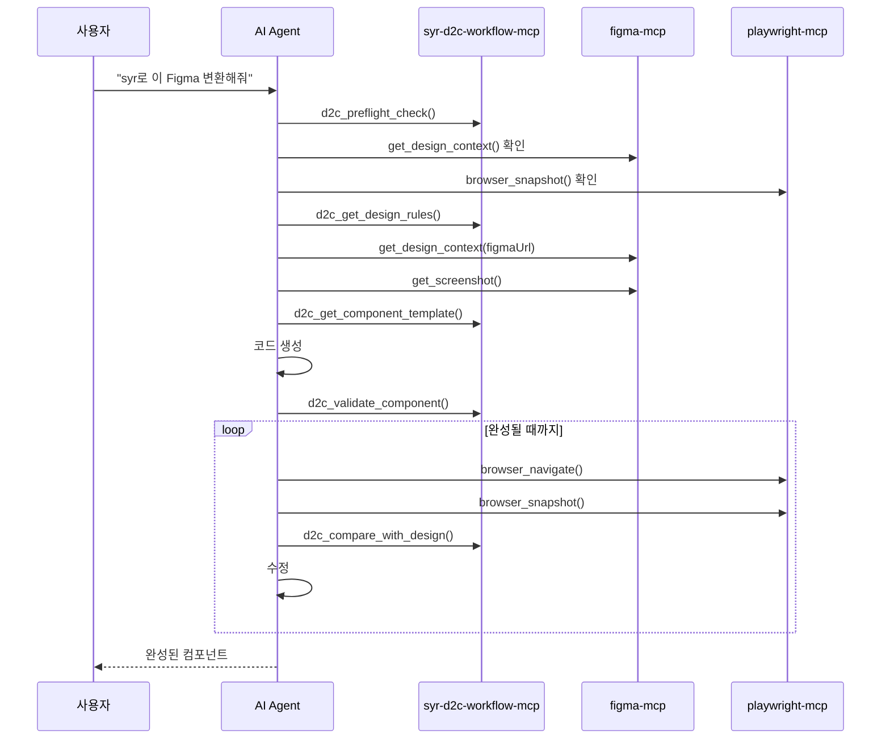

# SYR D2C Workflow MCP

Figma 디자인을 프로덕션 레디 컴포넌트로 변환하는 워크플로우 MCP 서버입니다.

## 기능

- 🎯 **의존성 사전 검사**: figma-mcp, playwright-mcp 설치 여부 확인 및 가이드
- 📋 **규칙 관리**: 여러 규칙 파일을 통합하여 로드
- 🔍 **컴포넌트 검증**: 생성된 코드가 규칙에 맞는지 검증
- 📊 **디자인 비교**: 원본 디자인과 렌더링 결과 비교
- 🎨 **템플릿 생성**: React/Vue/Svelte 보일러플레이트 생성
- 📚 **워크플로우 가이드**: 전체 D2C 프로세스를 안내하는 프롬프트

## 설치

### 사용처에서 설치

```json
// .vscode/mcp.json
{
  "servers": {
    "d2c": {
      "command": "npx",
      "args": ["syr-d2c-workflow-mcp"],
      "env": {
        "RULES_PATHS": "./docs/standards.md,./rules/components.md",
        "RULES_GLOB": "**/*-rules.md"
      }
    }
  }
}
```

### 함께 필요한 MCP들

```json
{
  "servers": {
    "d2c": {
      "command": "npx",
      "args": ["syr-d2c-workflow-mcp"]
    },
    "figma": {
      "command": "npx",
      "args": ["-y", "figma-developer-mcp", "--stdio"]
    },
    "playwright": {
      "command": "npx",
      "args": ["@anthropic/mcp-playwright"]
    }
  }
}
```

## 환경 변수

| 변수 | 설명 | 예시 |
|------|------|------|
| `RULES_PATHS` | 쉼표로 구분된 규칙 파일 경로들 | `./docs/a.md,./rules/b.md` |
| `RULES_GLOB` | 규칙 파일 glob 패턴 | `**/*-standards.md` |
| `D2C_CONFIG_PATH` | 설정 파일 경로 | `./d2c.config.json` |

### 설정 파일 예시

```json
// d2c.config.json
{
  "rules": [
    "./docs/design-standards.md",
    "./rules/component-rules.md",
    ".cursor/rules/*.md"
  ]
}
```

## 트리거 키워드

AI가 다음 키워드를 감지하면 이 MCP를 사용합니다:

- `syr`, `syr-d2c`, `d2cmcp`, `d2c mcp`
- "디자인 투 코드", "design to code", "figma 변환"
- "컴포넌트로 만들어줘", "코드로 변환해줘"

### 사용 예시

```
"syr로 이 Figma 변환해줘"
"d2c mcp로 컴포넌트 만들어줘"
"이 디자인을 코드로 변환해줘"
```

## 제공 도구 (Tools)

### `d2c_preflight_check`
워크플로우 실행 전 필수 의존성을 확인합니다.

### `d2c_get_design_rules`
설정된 경로들에서 디자인 규칙을 수집합니다.

```typescript
{
  customRules?: string;     // 추가 규칙
  includeDefaults?: boolean; // 기본 규칙 포함 (기본: true)
}
```

### `d2c_validate_component`
생성된 컴포넌트가 규칙에 맞는지 검증합니다.

```typescript
{
  code: string;           // 검증할 코드
  componentName: string;  // 컴포넌트 이름
  rules?: string;         // 적용할 규칙
}
```

### `d2c_compare_with_design`
Figma 디자인과 렌더링 결과를 비교 분석합니다.

```typescript
{
  designDescription: string;     // 원본 디자인 설명
  renderedDescription: string;   // 렌더링 결과 설명
  differences?: string[];        // 발견된 차이점
}
```

### `d2c_get_component_template`
규칙에 맞는 컴포넌트 템플릿을 생성합니다.

```typescript
{
  componentName: string;                    // 컴포넌트 이름
  framework?: "react" | "vue" | "svelte";   // 프레임워크
  props?: PropDefinition[];                 // Props 정의
  hasChildren?: boolean;                    // children 포함 여부
}
```

## 제공 프롬프트 (Prompts)

### `design_to_code`
전체 D2C 워크플로우를 단계별로 안내합니다:

1. 사전 검사 (의존성 확인)
2. 규칙 수집
3. Figma 디자인 가져오기
4. 컴포넌트 생성
5. 검증
6. 렌더링 확인 (반복)
7. 완료

## 제공 리소스 (Resources)

- `d2c://rules/default` - 기본 디자인 규칙
- `d2c://templates/react` - React 컴포넌트 템플릿

## 워크플로우



## 개발

```bash
# 의존성 설치
npm install

# 빌드
npm run build

# 개발 모드
npm run dev
```

## 라이선스

MIT
