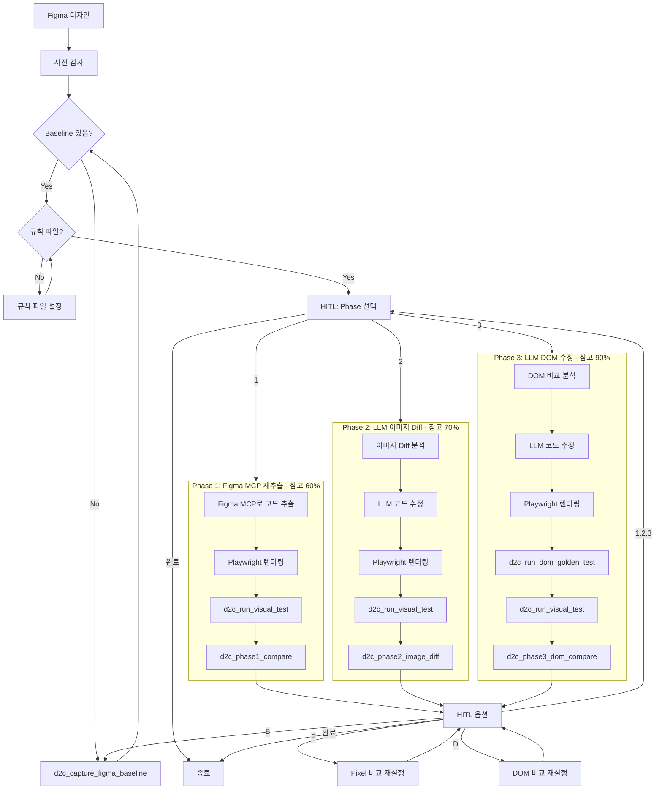
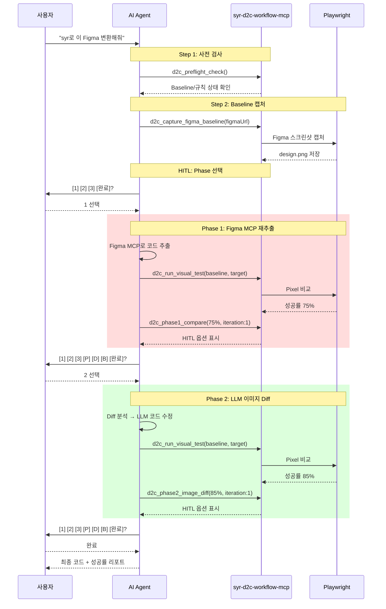

# SYR D2C Workflow MCP

Figma 디자인을 프로덕션 레디 컴포넌트로 변환하는 워크플로우 MCP 서버입니다.

## 기능

- 🎯 **의존성 사전 검사**: figma-mcp, playwright-mcp, baseline 스크린샷 확인
- 📸 **Baseline 캡처**: Playwright로 Figma 스크린샷 자동 캡처
- 📊 **Playwright 비교**: pixel 비교 및 DOM 비교 지원
- 🔄 **동등한 Phase 선택**: 1, 2, 3 Phase 자유 선택 (순서 강제 없음)
- ✋ **강화된 HITL**: Phase 선택 + 비교 재실행 + Baseline 재캡처
- 📋 **규칙 관리**: 여러 규칙 파일을 통합하여 로드
- 📚 **OpenSpec 통합**: 프로젝트 규칙 자동 탐지 및 검증

## 설치

### 사용처에서 설치

```json
// .vscode/mcp.json
{
  "servers": {
    "d2c": {
      "command": "npx",
      "args": ["syr-d2c-workflow-mcp"],
      "env": {
        "RULES_PATHS": "./docs/standards.md,./rules/components.md",
        "RULES_GLOB": "**/*-rules.md",
        "D2C_PHASE1_TARGET": "60",
        "D2C_PHASE2_TARGET": "70",
        "D2C_PHASE3_TARGET": "90"
      }
    }
  }
}
```

### 함께 필요한 MCP들

```json
{
  "servers": {
    "d2c": {
      "command": "npx",
      "args": ["syr-d2c-workflow-mcp"]
    },
    "figma": {
      "command": "npx",
      "args": ["-y", "figma-developer-mcp", "--stdio"]
    },
    "playwright": {
      "command": "npx",
      "args": ["@anthropic/mcp-playwright"]
    }
  }
}
```

## 환경 변수

| 변수 | 설명 | 예시 |
|------|------|------|
| `RULES_PATHS` | 쉼표로 구분된 규칙 파일 경로들 | `./docs/a.md,./rules/b.md` |
| `RULES_GLOB` | 규칙 파일 glob 패턴 | `**/*-standards.md` |
| `D2C_CONFIG_PATH` | 설정 파일 경로 | `./d2c.config.json` |
| `D2C_PROJECT_ROOT` | 프로젝트 루트 경로 | `/path/to/project` |
| `D2C_PHASE1_TARGET` | Phase 1 참고 기준 (기본: 60) | `50` |
| `D2C_PHASE2_TARGET` | Phase 2 참고 기준 (기본: 70) | `65` |
| `D2C_PHASE3_TARGET` | Phase 3 참고 기준 (기본: 90) | `85` |

## 트리거 키워드

AI가 다음 키워드를 감지하면 이 MCP를 사용합니다:

- `syr`, `syr-d2c`, `d2cmcp`, `d2c mcp`
- "디자인 투 코드", "design to code", "figma 변환"
- "컴포넌트로 만들어줘", "코드로 변환해줘"

## Phase 워크플로우 (v1.1.0)

### 동등한 Phase 선택

**Phase는 순서 없이 자유롭게 선택할 수 있습니다.**

| Phase | 수정 방식 | 참고 기준 |
|-------|----------|----------|
| **1** | Figma MCP 재추출 | 60% |
| **2** | LLM 이미지 diff 수정 | 70% |
| **3** | LLM DOM 수정 | 90% |

> 📌 참고 기준은 일반적 달성 수준이며, **모든 판단은 사용자가 합니다.**

### 워크플로우 다이어그램



### 시퀀스 다이어그램



### HITL (Human-in-the-Loop) 옵션

```
## ✋ HITL - 다음 작업을 선택하세요

**Phase 선택:**
- [1] Phase 1: Figma MCP 재추출
- [2] Phase 2: LLM 이미지 diff 수정
- [3] Phase 3: LLM DOM 수정

**비교 재실행:**
- [P] Pixel 비교 재실행
- [D] DOM 비교 재실행
- [B] Baseline 재캡처 (Figma 스크린샷)

**종료:**
- [완료] 현재 상태로 종료
```

## 제공 도구 (Tools)

### Baseline & 비교 도구

#### `d2c_capture_figma_baseline`
Playwright로 Figma 페이지 스크린샷을 캡처하여 baseline으로 저장합니다.

```typescript
{
  figmaUrl: string;      // Figma 디자인 URL
  selector?: string;     // 캡처할 요소 선택자
  waitTime?: number;     // 페이지 로드 대기 시간 (기본: 3000ms)
}
```

**저장 위치**: `./d2c-baseline/design.png`

#### `d2c_run_visual_test`
Playwright Test Runner로 pixel 비교 테스트를 실행합니다.

```typescript
{
  testName: string;           // 테스트 이름
  targetUrl: string;          // 렌더링 결과 URL
  baselineImagePath: string;  // baseline 이미지 경로
  maxDiffPixels?: number;     // 허용 최대 차이 픽셀 수 (기본: 100)
  threshold?: number;         // 픽셀 차이 임계값 (0-1, 기본: 0.1)
}
```

#### `d2c_run_dom_golden_test`
Playwright로 DOM golden 비교 테스트를 실행합니다. (Phase 3용)

```typescript
{
  testName: string;       // 테스트 이름
  targetUrl: string;      // 렌더링 결과 URL
  goldenDomPath: string;  // golden DOM JSON 파일 경로
  selectors?: string[];   // 비교할 CSS 선택자들
}
```

#### `d2c_create_dom_golden`
현재 페이지의 DOM 구조를 golden 파일로 저장합니다.

```typescript
{
  targetUrl: string;      // 기준 페이지 URL
  outputPath: string;     // 저장 경로
  selectors?: string[];   // 추출할 CSS 선택자들
}
```

### Phase 도구

#### `d2c_phase1_compare`
Phase 1 결과를 표시하고 HITL 옵션을 제공합니다.

```typescript
{
  successRate: number;      // Playwright 비교 성공률 (0-100)
  iteration: number;        // 현재 반복 횟수
  diffDetails?: string;     // 차이점 설명
  rulesPath?: string;       // 규칙 파일 경로
}
```

#### `d2c_phase2_image_diff`
Phase 2 결과를 표시하고 HITL 옵션을 제공합니다.

```typescript
{
  successRate: number;      // Playwright 비교 성공률 (0-100)
  iteration: number;        // 현재 반복 횟수
  diffAreas?: Array<{       // 차이 영역들
    area: string;
    type: string;
    severity: "high" | "medium" | "low";
  }>;
}
```

#### `d2c_phase3_dom_compare`
Phase 3 결과를 표시하고 HITL 옵션을 제공합니다. (DOM + Pixel 이중 성공률)

```typescript
{
  pixelSuccessRate?: number;  // Pixel 비교 성공률
  domSuccessRate?: number;    // DOM 비교 성공률
  iteration: number;          // 현재 반복 횟수
  domDiffs?: Array<{          // DOM 차이점들
    selector: string;
    type: string;
    expected?: string;
    actual?: string;
  }>;
}
```

### 사전 검사 도구

#### `d2c_preflight_check`
워크플로우 실행 전 필수 요소를 확인합니다.

**검사 항목**:
- 규칙 파일 (.md) 존재 여부
- Baseline 스크린샷 (`./d2c-baseline/design.png`) 존재 여부
- AI 설정 (Cursor rules, Copilot instructions)

#### `d2c_check_ai_setup`
AI 어시스턴트 설정 상태를 확인하고 추천 설정을 제공합니다.

### 기타 도구

#### `d2c_get_design_rules`
설정된 경로들에서 디자인 규칙을 수집합니다.

#### `d2c_validate_component`
생성된 컴포넌트가 규칙에 맞는지 검증합니다.

#### `d2c_get_component_template`
규칙에 맞는 컴포넌트 템플릿을 생성합니다.

#### `d2c_workflow_status`
전체 워크플로우 진행 상황을 표시합니다.

## 제공 프롬프트 (Prompts)

### `design_to_code`
전체 D2C 워크플로우를 안내합니다:

1. 사전 검사 + Phase 선택
2. Figma 디자인 가져오기
3. Phase 실행 (선택한 Phase)
4. 성공률 확인 + HITL
5. 완료

## 제공 리소스 (Resources)

- `d2c://rules/default` - 기본 디자인 규칙
- `d2c://templates/react` - React 컴포넌트 템플릿

## OpenSpec 규칙 통합

프로젝트의 OpenSpec 규칙을 자동으로 탐지하고 워크플로우에 적용합니다.

### 탐지 경로

1. `./openspec/specs/*/spec.md`
2. `./.cursor/openspec/specs/*/spec.md`
3. `./docs/openspec/specs/*/spec.md`

### OpenSpec 도구

#### `d2c_load_openspec_rules`
프로젝트의 OpenSpec 규칙을 탐지하고 로드합니다.

#### `d2c_get_workflow_tasks`
현재 Phase에 맞는 체크리스트를 반환합니다.

#### `d2c_validate_against_spec`
생성된 코드가 OpenSpec 규칙을 준수하는지 검증합니다.

## 빠른 시작

```bash
# 1. Baseline 캡처
d2c_capture_figma_baseline({
  figmaUrl: "https://www.figma.com/design/..."
})

# 2. 사전 검사 + Phase 선택
d2c_preflight_check()

# 3. Phase 실행 후 비교
d2c_run_visual_test({
  testName: "my-component",
  targetUrl: "http://localhost:3000",
  baselineImagePath: "./d2c-baseline/design.png"
})

# 4. 결과 확인 + HITL
d2c_phase1_compare({
  successRate: 75.5,
  iteration: 1
})
```

## 개발

```bash
# 의존성 설치
npm install

# 빌드
npm run build

# 개발 모드
npm run dev
```

## 변경 이력

### v1.1.0
- `d2c_capture_figma_baseline` 도구 추가 (Playwright로 Figma 스크린샷 캡처)
- Preflight 검사에 Baseline 확인 추가
- HITL 옵션 확장: [P] Pixel 비교, [D] DOM 비교, [B] Baseline 재캡처

### v1.0.0
- Phase 동등 선택 구조로 변경 (순차 → 자유 선택)
- 목표 성공률 → 참고 기준으로 변경
- 통합 HITL 옵션 ([1] [2] [3] [완료])
- Phase 3 DOM + Pixel 이중 성공률 표시

### v0.9.0
- Playwright Test Runner 통합 (`toHaveScreenshot`, DOM golden 비교)
- `d2c_run_visual_test`, `d2c_run_dom_golden_test`, `d2c_create_dom_golden` 추가

### v0.8.0
- 규칙 파일 필수 검사 추가
- `RULES_PATHS`, `RULES_GLOB` 환경변수 지원

### v0.7.0
- DOM 비교 기능 추가
- Phase 3 픽셀/DOM 이중 성공률 지원

### v0.6.0
- pixelmatch 기반 객관적 이미지 비교
- 강제 HITL 도입

## 라이선스

MIT
