# SYR D2C Workflow MCP

Figma 디자인을 프로덕션 레디 컴포넌트로 변환하는 워크플로우 MCP 서버입니다.

## 기능

- 🎯 **의존성 사전 검사**: figma-mcp, playwright-mcp 설치 여부 확인 및 가이드
- 📋 **규칙 관리**: 여러 규칙 파일을 통합하여 로드
- 🔍 **컴포넌트 검증**: 생성된 코드가 규칙에 맞는지 검증
- 📊 **디자인 비교**: 원본 디자인과 렌더링 결과 비교
- 🎨 **템플릿 생성**: React/Vue/Svelte 보일러플레이트 생성
- 📚 **워크플로우 가이드**: 전체 D2C 프로세스를 안내하는 프롬프트

## 설치

### 사용처에서 설치

```json
// .vscode/mcp.json
{
  "servers": {
    "d2c": {
      "command": "npx",
      "args": ["syr-d2c-workflow-mcp"],
      "env": {
        "RULES_PATHS": "./docs/standards.md,./rules/components.md",
        "RULES_GLOB": "**/*-rules.md"
      }
    }
  }
}
```

### 함께 필요한 MCP들

```json
{
  "servers": {
    "d2c": {
      "command": "npx",
      "args": ["syr-d2c-workflow-mcp"]
    },
    "figma": {
      "command": "npx",
      "args": ["-y", "figma-developer-mcp", "--stdio"]
    },
    "playwright": {
      "command": "npx",
      "args": ["@anthropic/mcp-playwright"]
    }
  }
}
```

## 환경 변수

| 변수 | 설명 | 예시 |
|------|------|------|
| `RULES_PATHS` | 쉼표로 구분된 규칙 파일 경로들 | `./docs/a.md,./rules/b.md` |
| `RULES_GLOB` | 규칙 파일 glob 패턴 | `**/*-standards.md` |
| `D2C_CONFIG_PATH` | 설정 파일 경로 | `./d2c.config.json` |

### 설정 파일 예시

```json
// d2c.config.json
{
  "rules": [
    "./docs/design-standards.md",
    "./rules/component-rules.md",
    ".cursor/rules/*.md"
  ]
}
```

## 트리거 키워드

AI가 다음 키워드를 감지하면 이 MCP를 사용합니다:

- `syr`, `syr-d2c`, `d2cmcp`, `d2c mcp`
- "디자인 투 코드", "design to code", "figma 변환"
- "컴포넌트로 만들어줘", "코드로 변환해줘"

### 사용 예시

```
"syr로 이 Figma 변환해줘"
"d2c mcp로 컴포넌트 만들어줘"
"이 디자인을 코드로 변환해줘"
```

## 제공 도구 (Tools)

### `d2c_preflight_check`
워크플로우 실행 전 필수 의존성을 확인합니다.

### `d2c_get_design_rules`
설정된 경로들에서 디자인 규칙을 수집합니다.

```typescript
{
  customRules?: string;     // 추가 규칙
  includeDefaults?: boolean; // 기본 규칙 포함 (기본: true)
}
```

### `d2c_validate_component`
생성된 컴포넌트가 규칙에 맞는지 검증합니다.

```typescript
{
  code: string;           // 검증할 코드
  componentName: string;  // 컴포넌트 이름
  rules?: string;         // 적용할 규칙
}
```

### `d2c_compare_with_design`
Figma 디자인과 렌더링 결과를 비교 분석합니다.

```typescript
{
  designDescription: string;     // 원본 디자인 설명
  renderedDescription: string;   // 렌더링 결과 설명
  differences?: string[];        // 발견된 차이점
}
```

### `d2c_get_component_template`
규칙에 맞는 컴포넌트 템플릿을 생성합니다.

```typescript
{
  componentName: string;                    // 컴포넌트 이름
  framework?: "react" | "vue" | "svelte";   // 프레임워크
  props?: PropDefinition[];                 // Props 정의
  hasChildren?: boolean;                    // children 포함 여부
}
```

## 제공 프롬프트 (Prompts)

### `design_to_code`
전체 D2C 워크플로우를 단계별로 안내합니다:

1. 사전 검사 (의존성 확인)
2. 규칙 수집
3. Figma 디자인 가져오기
4. 컴포넌트 생성
5. 검증
6. 렌더링 확인 (반복)
7. 완료

## 제공 리소스 (Resources)

- `d2c://rules/default` - 기본 디자인 규칙
- `d2c://templates/react` - React 컴포넌트 템플릿

## 3단계 Phase 워크플로우

v0.3.0부터 객관적인 성공률 측정을 위한 3단계 Phase 시스템을 지원합니다.

| Phase | 목표 성공률 | 비교 방법 | 수정 주체 |
|-------|-----------|----------|----------|
| **Phase 1** | 60% | Playwright 스크린샷 비교 | Figma MCP (재추출) |
| **Phase 2** | 70% | Playwright 이미지 diff | LLM (코드 수정) |
| **Phase 3** | 90% | Playwright DOM 비교 | LLM (코드 수정) |

### 워크플로우 개요

```mermaid
flowchart TD
    Start[Figma 디자인] --> Preflight[사전 검사]
    Preflight --> FigmaGet[Figma 디자인 가져오기]
    
    subgraph Phase1 [Phase 1: Figma MCP 추출 - 60%]
        P1_Extract[Figma MCP로 코드 추출]
        P1_Render[Playwright 렌더링]
        P1_Compare[스크린샷 비교]
        P1_Check{성공률 >= 60%?}
        P1_HITL[HITL: 계속?]
        
        P1_Extract --> P1_Render --> P1_Compare --> P1_Check
        P1_Check -->|No| P1_HITL
        P1_HITL -->|Yes| P1_Extract
        P1_HITL -->|Manual| P1_Render
    end
    
    FigmaGet --> Phase1
    P1_Check -->|Yes| Phase2
    
    subgraph Phase2 [Phase 2: LLM 이미지 Diff - 70%]
        P2_Diff[이미지 Diff 분석]
        P2_LLM[LLM 코드 수정]
        P2_Render[Playwright 렌더링]
        P2_Compare[스크린샷 비교]
        P2_Check{성공률 >= 70%?}
        P2_HITL[HITL: 계속?]
        
        P2_Diff --> P2_LLM --> P2_Render --> P2_Compare --> P2_Check
        P2_Check -->|No| P2_HITL
        P2_HITL -->|Yes| P2_Diff
        P2_HITL -->|Manual| P2_Render
    end
    
    P2_Check -->|Yes| Phase3
    
    subgraph Phase3 [Phase 3: LLM DOM 비교 - 90%]
        P3_DOM[DOM 스냅샷 비교]
        P3_LLM[LLM 코드 수정]
        P3_Render[Playwright 렌더링]
        P3_Compare[DOM 비교]
        P3_Check{성공률 >= 90%?}
        P3_HITL[HITL: 계속?]
        
        P3_DOM --> P3_LLM --> P3_Render --> P3_Compare --> P3_Check
        P3_Check -->|No| P3_HITL
        P3_HITL -->|Yes| P3_DOM
        P3_HITL -->|Manual| P3_Render
    end
    
    P3_Check -->|Yes| Done[완료]
```



### 시퀀스 다이어그램

```mermaid
sequenceDiagram
    participant User as 사용자
    participant AI as AI Agent
    participant D2C as syr-d2c-workflow-mcp
    participant Figma as figma-mcp
    participant PW as playwright-mcp

    User->>AI: "syr로 이 Figma 변환해줘"
    
    Note over AI,D2C: Step 1: 사전 검사
    AI->>D2C: d2c_preflight_check()
    AI->>Figma: get_design_context() 확인
    AI->>PW: browser_snapshot() 확인
    
    Note over AI,Figma: Step 2: Figma 디자인 가져오기
    AI->>Figma: get_design_context(figmaUrl)
    AI->>Figma: get_screenshot()
    
    rect rgb(255, 240, 240)
        Note over AI,PW: Phase 1: Figma MCP 추출 (목표 60%)
        loop 성공률 < 60% && HITL 승인
            AI->>Figma: 코드 재추출
            AI->>PW: browser_navigate() + screenshot
            AI->>D2C: d2c_phase1_compare(successRate, iteration)
            AI->>User: HITL 확인 요청
        end
    end
    
    rect rgb(240, 255, 240)
        Note over AI,PW: Phase 2: LLM 이미지 Diff (목표 70%)
        loop 성공률 < 70% && HITL 승인
            AI->>PW: 이미지 diff 분석
            AI->>AI: LLM 코드 수정
            AI->>PW: browser_navigate() + screenshot
            AI->>D2C: d2c_phase2_image_diff(successRate, diffAreas)
            AI->>User: HITL 확인 요청
        end
    end
    
    rect rgb(240, 240, 255)
        Note over AI,PW: Phase 3: LLM DOM 비교 (목표 90%)
        loop 성공률 < 90% && HITL 승인
            AI->>PW: DOM 스냅샷 비교
            AI->>AI: LLM 코드 수정
            AI->>PW: browser_navigate() + DOM 비교
            AI->>D2C: d2c_phase3_dom_compare(successRate, domDiffs)
            AI->>User: HITL 확인 요청
        end
    end
    
    AI->>D2C: d2c_workflow_status(phase1, phase2, phase3)
    AI-->>User: 완성된 컴포넌트 + 최종 리포트
```



### HITL (Human-in-the-Loop)

모든 Phase에서 사용자 개입이 가능합니다:

- **[Y]** 계속 - 자동 수정 후 반복
- **[N]** 완료 - 현재 상태로 다음 단계 진행
- **[M]** 수동 수정 - 사용자가 직접 코드 수정 후 재비교
- **[S]** 중단 - 워크플로우 종료

### Phase별 도구

#### `d2c_phase1_compare`
Phase 1 스크린샷 비교 결과를 처리합니다.

```typescript
{
  successRate: number;      // Playwright 비교 성공률 (0-100)
  targetRate?: number;      // 목표 성공률 (기본: 60)
  iteration: number;        // 현재 반복 횟수
  maxIterations?: number;   // 최대 반복 (기본: 5)
  diffDetails?: string;     // 차이점 설명
}
```

#### `d2c_phase2_image_diff`
Phase 2 이미지 diff 결과를 처리합니다.

```typescript
{
  successRate: number;      // Playwright 비교 성공률 (0-100)
  targetRate?: number;      // 목표 성공률 (기본: 70)
  iteration: number;        // 현재 반복 횟수
  diffAreas?: Array<{       // 차이 영역들
    area: string;           // 영역 (예: "header", "button")
    type: string;           // 유형 (color, layout, spacing)
    severity: "high" | "medium" | "low";
  }>;
}
```

#### `d2c_phase3_dom_compare`
Phase 3 DOM 비교 결과를 처리합니다.

```typescript
{
  successRate: number;      // DOM 비교 성공률 (0-100)
  targetRate?: number;      // 목표 성공률 (기본: 90)
  iteration: number;        // 현재 반복 횟수
  domDiffs?: Array<{        // DOM 차이점들
    selector: string;       // 요소 선택자
    type: string;           // missing, extra, attribute, text
    expected?: string;      // 예상 값
    actual?: string;        // 실제 값
  }>;
}
```

#### `d2c_workflow_status`
전체 워크플로우 진행 상황을 표시합니다.

```typescript
{
  currentPhase: 1 | 2 | 3;
  phase1?: { status: string; successRate: number; iterations: number; };
  phase2?: { status: string; successRate: number; iterations: number; };
  phase3?: { status: string; successRate: number; iterations: number; };
}
```

## 개발

```bash
# 의존성 설치
npm install

# 빌드
npm run build

# 개발 모드
npm run dev
```

## 라이선스

MIT
