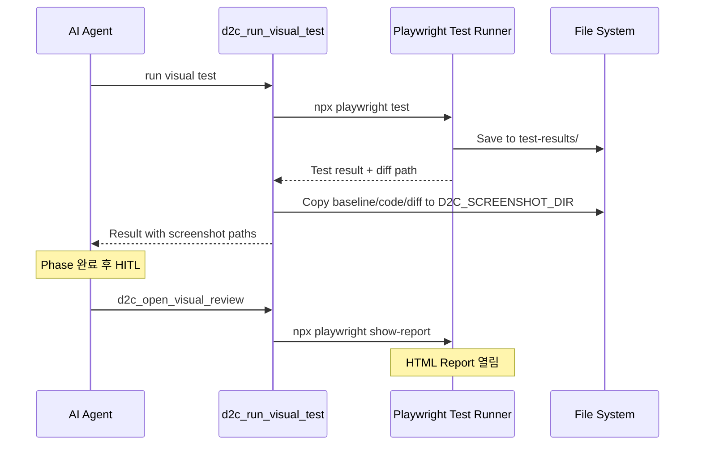

# Design: HITL 육안 비교 및 스크린샷 이력 저장

## Context

D2C 워크플로우에서 각 Phase의 pixel 비교 결과는 수치(성공률)로만 표시됩니다. 사용자가 실제 diff 이미지를 육안으로 확인하고 싶을 때 별도의 방법이 필요합니다. 또한 비교 이력을 추적하기 위해 스크린샷을 저장해야 하는데, 현재 구현이 제대로 작동하지 않습니다.

## Goals / Non-Goals

### Goals
- HITL에서 육안 비교 옵션 제공
- 각 비교 시 baseline/code/diff 3벌 스크린샷 이력 저장
- Playwright HTML reporter를 통한 직관적인 diff 확인

### Non-Goals
- 별도의 이미지 뷰어 구현 (Playwright HTML reporter 활용)
- 자동 diff 분석 및 수정 제안 (기존 Phase 로직 유지)

## Decisions

### 1. 육안 비교 방식: Playwright HTML Reporter

**결정**: Playwright의 built-in HTML reporter를 활용

**이유**:
- 별도 구현 없이 Playwright 기능 활용
- Baseline, Actual, Diff 3벌을 한 화면에서 비교 가능
- 슬라이더로 overlay 비교 지원
- `npx playwright show-report` 명령으로 간단히 실행

**대안 고려**:
- VS Code 이미지 비교 확장: IDE 의존성
- 커스텀 HTML 페이지: 추가 구현 필요

### 2. 스크린샷 저장 구조

**결정**: `D2C_SCREENSHOT_DIR`에 timestamp 기반 파일명으로 저장

```
.d2c-screenshots/
├── phase1-v1-baseline-20260128-143052.png
├── phase1-v1-code-20260128-143052.png
├── phase1-v1-diff-20260128-143052.png
├── phase1-v2-baseline-20260128-145030.png
├── phase1-v2-code-20260128-145030.png
├── phase1-v2-diff-20260128-145030.png
└── ...
```

**이유**:
- Phase/iteration별 이력 추적 용이
- timestamp로 시간순 정렬 가능
- 같은 iteration 내 3벌이 같은 timestamp 공유

### 3. diff 이미지 복사 타이밍

**결정**: `runPlaywrightTest` 완료 후 Playwright의 test-results에서 복사

**이유**:
- Playwright가 `toHaveScreenshot()` 실패 시 자동으로 diff 생성
- diff 경로: `.d2c-tests/test-results/[test-name]-diff.png`
- 테스트 완료 후 해당 파일을 `D2C_SCREENSHOT_DIR`에 복사

## Architecture



## Risks / Trade-offs

| 리스크 | 완화 방안 |
|--------|-----------|
| HTML reporter가 설치되지 않을 수 있음 | 기본 포함된 reporter 사용, 없으면 안내 |
| 스크린샷 누적으로 디스크 사용량 증가 | `.gitignore`에 추가 권장, 정리 도구 제공 고려 |
| Windows에서 경로 문제 | `path.join` 사용으로 크로스 플랫폼 지원 |

## Migration Plan

1. 기존 `d2c_run_visual_test` 결과 형식 유지 (하위 호환)
2. 새 필드 추가: `savedScreenshots` 객체
3. HITL 옵션 추가는 기존 옵션 유지하면서 새 옵션 append

## Open Questions

- [ ] HTML reporter 자동 열기 vs 경로만 제공 중 어느 것이 나은지?
- [ ] 스크린샷 보관 기간/개수 제한 필요 여부?
