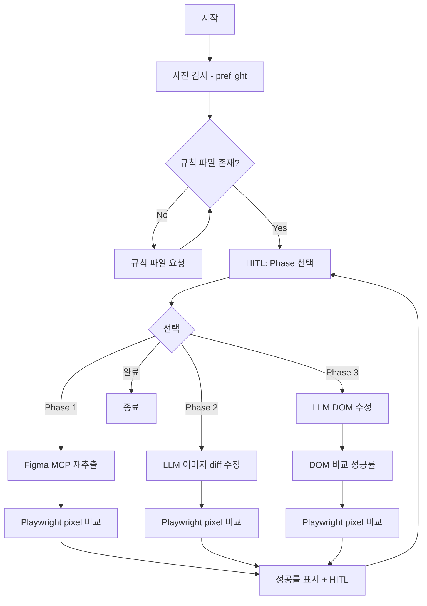

# Proposal: flatten-phase-hierarchy

## 개요

Phase 1, 2, 3의 순차적 계층 구조를 제거하고, 사용자가 자유롭게 Phase를 선택할 수 있는 **동등한(flat) 구조**로 변경합니다.

## 배경 (Why)

### 현재 문제점

1. **고정된 순서**: Phase 1 → Phase 2 → Phase 3로 진행되어 유연성 부족
2. **자동 목표 달성 판단**: 성공률이 목표(60/70/90%)에 도달하면 자동으로 다음 Phase 권장
3. **사용자 판단 제한**: 시스템이 "권장"을 제시하여 사용자의 판단 여지가 줄어듦

### 변경 필요성

- 각 Phase의 수정 방식(Figma 재추출, LLM 이미지 diff, LLM DOM)은 상황에 따라 효과가 다름
- 사용자가 현재 상황을 보고 가장 적합한 Phase를 직접 선택하는 것이 더 효과적
- 목표 성공률은 "참고 기준"일 뿐, 실제 판단은 사람이 해야 함

## 변경 내용 (What)

### 1. Phase 순서 제거

| 항목 | 현재 | 변경 후 |
|------|------|---------|
| Phase 관계 | 순차적 (1→2→3) | 동등한 선택지 (1, 2, 3) |
| Phase 선택 | 시스템 권장 기반 | 사용자 자유 선택 |
| 목표 성공률 | 필수 달성 기준 | 참고 기준만 표시 |

### 2. 새 워크플로우



### 3. Phase별 출력 변경

**Phase 1, 2 출력**:
```
━━━━━━━━━━━━━━━━━━━━━━━━━━━━
📊 Phase 1 결과
━━━━━━━━━━━━━━━━━━━━━━━━━━━━
픽셀 성공률: ████████░░ 82.3%

📌 참고 기준: Phase 1 (60%), Phase 2 (70%), Phase 3 (90%)

✋ HITL - 다음 작업을 선택하세요
[1] Phase 1: Figma MCP 재추출
[2] Phase 2: LLM 이미지 diff 수정
[3] Phase 3: LLM DOM 수정
[완료] 현재 상태로 종료
━━━━━━━━━━━━━━━━━━━━━━━━━━━━
```

**Phase 3 출력**:
```
━━━━━━━━━━━━━━━━━━━━━━━━━━━━
📊 Phase 3 결과
━━━━━━━━━━━━━━━━━━━━━━━━━━━━
DOM 성공률:   ███████░░░ 75.0%
픽셀 성공률: ████████░░ 85.2%

📌 참고 기준: Phase 1 (60%), Phase 2 (70%), Phase 3 (90%)

✋ HITL - 다음 작업을 선택하세요
[1] Phase 1: Figma MCP 재추출
[2] Phase 2: LLM 이미지 diff 수정
[3] Phase 3: LLM DOM 수정
[완료] 현재 상태로 종료
━━━━━━━━━━━━━━━━━━━━━━━━━━━━
```

## 영향 범위 (Impact)

### 변경되는 도구

| 도구 | 변경 내용 |
|------|----------|
| `d2c_phase1_compare` | 목표 달성 여부 제거, 통합 HITL 옵션 추가 |
| `d2c_phase2_image_diff` | 목표 달성 여부 제거, 통합 HITL 옵션 추가 |
| `d2c_phase3_dom_compare` | DOM + pixel 두 성공률 표시, 통합 HITL 옵션 추가 |
| `design_to_code` prompt | 워크플로우 설명 업데이트 |

### 하위 호환성

- 기존 파라미터(`targetRate`, `maxIterations` 등)는 유지하되 동작 변경
- `targetRate`는 "참고 기준" 표시용으로만 사용

## 관련 변경

- `enforce-hitl-between-phases`: HITL 강제 구현 (완료)
- 이 변경은 HITL 구조를 확장하여 Phase 선택까지 포함
