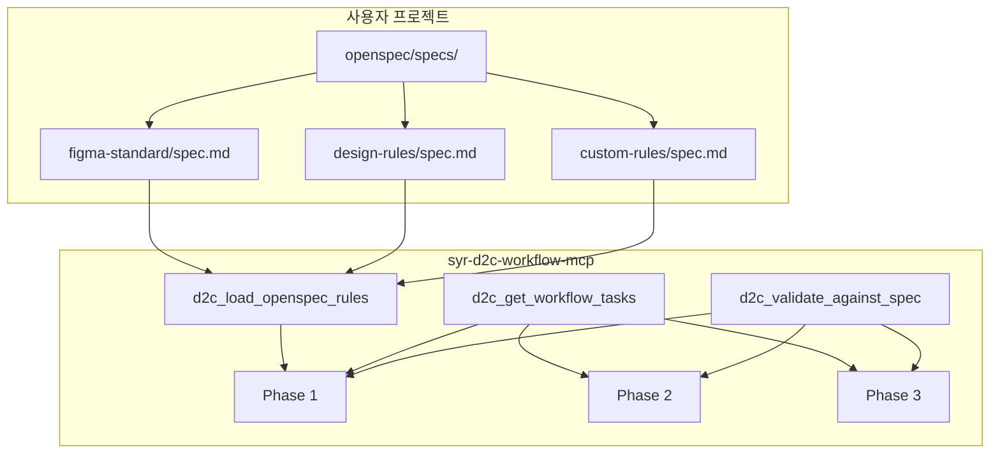

# Design: OpenSpec 기반 워크플로우 통합

## Context

사용자가 프로젝트에 OpenSpec으로 Figma 변환 규칙을 정의해두면(예: `figma-standard`), MCP가 이를 자동으로 인식하고 워크플로우 전반에 걸쳐 활용합니다.

## Goals / Non-Goals

**Goals:**
- 사용자 프로젝트의 OpenSpec 규칙 자동 탐지
- 규칙 기반 코드 생성 가이드 제공
- tasks.md 형식으로 워크플로우 체크리스트 제공
- OpenSpec 규칙 준수 검증

**Non-Goals:**
- openspec CLI 필수 의존성 (선택적 사용)
- OpenSpec 규칙 자동 생성 (사용자가 정의)

## Architecture



## Decisions

### 1. OpenSpec 규칙 탐지 경로

**결정**: 다음 경로에서 순차적으로 탐지

```typescript
const OPENSPEC_SEARCH_PATHS = [
  "./openspec/specs/*/spec.md",           // 프로젝트 루트
  "./.cursor/openspec/specs/*/spec.md",   // Cursor 설정
  "./docs/openspec/specs/*/spec.md",      // docs 폴더
];
```

### 2. 규칙 우선순위

**결정**: 다음 순서로 규칙 적용

1. 환경변수로 지정된 규칙 (기존)
2. 사용자 프로젝트 OpenSpec 규칙
3. MCP 내장 기본 규칙

### 3. tasks.md 형식 출력

**결정**: 각 Phase 시작 시 체크리스트 형식으로 출력

```markdown
## Phase 1: Figma MCP 추출 (목표 60%)

### Tasks
- [ ] 1.1 Figma 디자인 컨텍스트 가져오기
- [ ] 1.2 Figma MCP로 코드 추출
- [ ] 1.3 Playwright 렌더링
- [ ] 1.4 스크린샷 비교
- [ ] 1.5 성공률 확인 (목표: 60%)
- [ ] 1.6 HITL 확인

### 적용 규칙
- figma-standard: 컴포넌트 네이밍 규칙
- design-rules: 색상/타이포그래피 규칙
```

### 4. 검증 로직

**결정**: 생성된 코드가 OpenSpec 규칙의 각 Requirement를 충족하는지 검증

```typescript
interface ValidationResult {
  specName: string;
  requirement: string;
  status: "pass" | "fail" | "warn";
  message: string;
}
```

## Risks / Trade-offs

| Risk | Mitigation |
|------|------------|
| 사용자 프로젝트에 OpenSpec 없음 | 선택적 기능, 없으면 기존 방식 유지 |
| OpenSpec 규칙 파싱 복잡도 | 기본 마크다운 파싱만 수행 |
| 검증 로직 정확도 | 단순 패턴 매칭 + AI 보조 |

## Open Questions

1. OpenSpec의 Scenario 형식을 코드 검증에 어떻게 활용할지
2. 규칙 충돌 시 해결 방법
