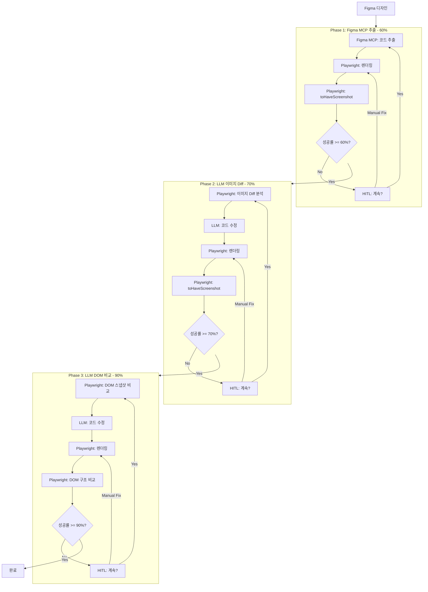

# Design: 3단계 검증 워크플로우

## Context

현재 D2C 워크플로우는 AI가 시각적 비교 후 주관적 점수를 부여합니다.
이를 Playwright의 객관적 비교 API로 대체하여 신뢰성 있는 품질 검증을 구현합니다.

## Goals / Non-Goals

**Goals:**
- Playwright `toHaveScreenshot()` 활용한 픽셀 단위 비교
- 각 Phase별 명확한 역할 분리 (Figma MCP vs LLM)
- HITL로 사용자 개입 보장
- 성공률 실시간 표시

**Non-Goals:**
- Playwright 테스트 러너 직접 통합 (MCP 통해 간접 활용)
- 100% 완벽한 자동화 (HITL 필수)

## Architecture



## Decisions

### 1. 성공률 계산 방식

**결정**: Playwright `toHaveScreenshot()`의 threshold 옵션 활용

```typescript
// Phase 1, 2: 픽셀 비교
await expect(page).toHaveScreenshot('design.png', {
  maxDiffPixelRatio: 0.4  // 60% 일치 = 40% diff 허용
});

// Phase 3: DOM 비교는 별도 로직
```

**대안 검토**:
- pixelmatch 직접 사용 → MCP 통신 복잡도 증가로 기각
- AI 시각 비교 유지 → 객관성 부족으로 기각

### 2. Phase 간 데이터 전달

**결정**: 각 Phase 결과를 다음 Phase 입력으로 전달

```typescript
interface PhaseResult {
  phase: 1 | 2 | 3;
  successRate: number;
  code: string;
  screenshotPath: string;
  domSnapshot?: string;
  iteration: number;
}
```

### 3. HITL 구현 방식

**결정**: 각 Phase 도구가 `recommendation` 반환, AI가 사용자에게 확인

```typescript
{
  recommendation: "continue" | "user_confirm" | "phase_complete",
  currentRate: 55,
  targetRate: 60,
  message: "현재 55%, 목표 60%. 계속하시겠습니까?"
}
```

## Risks / Trade-offs

| Risk | Mitigation |
|------|------------|
| Playwright MCP가 `toHaveScreenshot` 미지원 | 대안: browser_snapshot 후 외부 비교 |
| DOM 비교 복잡도 | 핵심 요소만 비교 (구조, 클래스, 텍스트) |
| Phase 전환 기준 모호 | 명확한 threshold + HITL 확인 |

## Open Questions

1. Playwright MCP가 제공하는 정확한 API 범위 확인 필요
2. DOM 비교 시 어떤 속성까지 비교할지 (style, class, structure)
