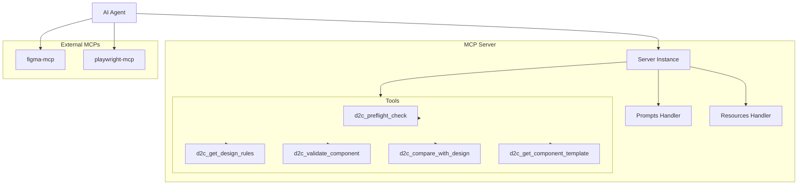
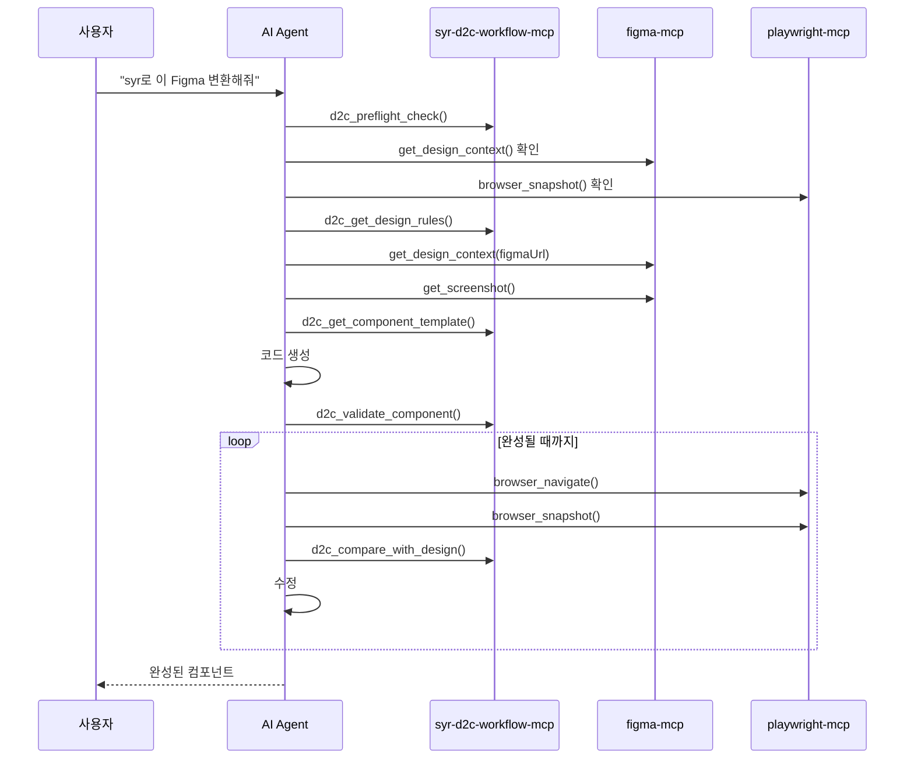

# Project Context

## Purpose

SYR D2C Workflow MCP는 Figma 디자인을 프로덕션 레디 컴포넌트로 변환하는 워크플로우를 제공하는 MCP(Model Context Protocol) 서버입니다.

### 주요 목표
- Figma 디자인에서 React/Vue/Svelte 컴포넌트를 자동 생성
- 프로젝트별 디자인 규칙 적용 및 검증
- 렌더링 결과와 원본 디자인 비교를 통한 품질 보장
- AI 에이전트(Claude, Cursor)와의 원활한 통합

### 주요 기능
- 🎯 **의존성 사전 검사**: figma-mcp, playwright-mcp 설치 여부 확인
- 📋 **규칙 관리**: 여러 규칙 파일을 통합하여 로드
- 🔍 **컴포넌트 검증**: 생성된 코드가 규칙에 맞는지 검증
- 📊 **디자인 비교**: 원본 디자인과 렌더링 결과 비교
- 🎨 **템플릿 생성**: React/Vue/Svelte 보일러플레이트 생성

## Tech Stack

### 핵심 기술
- **언어**: TypeScript 5.x
- **런타임**: Node.js >= 18
- **모듈 시스템**: ES Modules (ESM)

### 의존성
| 패키지 | 버전 | 용도 |
|--------|------|------|
| @modelcontextprotocol/sdk | ^1.0.0 | MCP 서버 구현 |
| zod | ^3.23.8 | 입력 스키마 검증 |
| glob | ^11.0.0 | 파일 패턴 매칭 |

### 개발 의존성
| 패키지 | 버전 | 용도 |
|--------|------|------|
| typescript | ^5.0.0 | TypeScript 컴파일러 |
| @types/node | ^20.0.0 | Node.js 타입 정의 |

## Project Conventions

### Code Style
- **언어**: TypeScript strict 모드 사용
- **포맷터**: 기본 TypeScript 포맷팅
- **네이밍**:
  - 변수/함수: camelCase
  - 상수: UPPER_SNAKE_CASE
  - 타입/인터페이스: PascalCase
- **문자열**: 큰따옴표(`"`) 사용
- **들여쓰기**: 2 spaces
- **주석/문서**: 한국어 사용

### Architecture Patterns



**주요 패턴**:
- **MCP 서버 패턴**: Tools, Prompts, Resources 제공
- **Stdio 통신**: StdioServerTransport 사용
- **스키마 검증**: Zod를 사용한 입력 검증
- **규칙 로딩**: 환경변수, 설정 파일, glob 패턴 지원

### Testing Strategy
- 현재 테스트 프레임워크 미설정
- 추후 필요시 Vitest 또는 Jest 도입 권장

### Git Workflow
- **주 브랜치**: main
- **커밋 메시지**: 한국어 또는 영어, 명령형 사용
- **버전 관리**: package.json의 version 필드 사용

## Domain Context

### MCP (Model Context Protocol)
- Anthropic에서 정의한 AI 에이전트 통신 프로토콜
- Tools, Prompts, Resources 세 가지 기능 제공
- stdio 또는 HTTP 기반 통신 지원

### D2C (Design-to-Code) 워크플로우



### 서비스 트리거 키워드
AI가 다음 키워드를 감지하면 이 MCP 사용:
- `syr`, `syr-d2c`, `d2cmcp`, `d2c mcp`
- "디자인 투 코드", "design to code", "figma 변환"
- "컴포넌트로 만들어줘", "코드로 변환해줘"

## Important Constraints

### 기술적 제약
- Node.js >= 18 필수
- ES Modules 전용 (CommonJS 미지원)
- stdio 통신만 지원 (HTTP 미지원)

### 런타임 의존성
- figma-mcp와 playwright-mcp가 함께 설치되어야 전체 워크플로우 동작
- Figma Desktop 앱 설치 및 Dev Mode 활성화 필요

### 환경 변수
| 변수 | 설명 | 예시 |
|------|------|------|
| `RULES_PATHS` | 쉼표로 구분된 규칙 파일 경로 | `./docs/a.md,./rules/b.md` |
| `RULES_GLOB` | 규칙 파일 glob 패턴 | `**/*-standards.md` |
| `D2C_CONFIG_PATH` | 설정 파일 경로 | `./d2c.config.json` |

## External Dependencies

### 필수 연동 MCP
| MCP | 용도 | 설치 |
|-----|------|------|
| figma-developer-mcp | Figma 디자인 가져오기 | `npx -y figma-developer-mcp --stdio` |
| @anthropic/mcp-playwright | 렌더링 결과 스크린샷 | `npx @anthropic/mcp-playwright` |

### MCP 설정 예시

```json
{
  "servers": {
    "d2c": {
      "command": "npx",
      "args": ["syr-d2c-workflow-mcp"],
      "env": {
        "RULES_PATHS": "./docs/standards.md,./rules/components.md"
      }
    },
    "figma": {
      "command": "npx",
      "args": ["-y", "figma-developer-mcp", "--stdio"]
    },
    "playwright": {
      "command": "npx",
      "args": ["@anthropic/mcp-playwright"]
    }
  }
}
```

## 프로젝트 구조

```
syr-d2c-workflow-mcp/
├── src/
│   └── index.ts          # MCP 서버 메인 코드
├── dist/                 # 빌드 출력
├── openspec/             # OpenSpec 문서
├── .cursor/              # Cursor 설정
│   └── commands/         # OpenSpec 명령어
├── package.json
├── tsconfig.json
└── README.md
```
